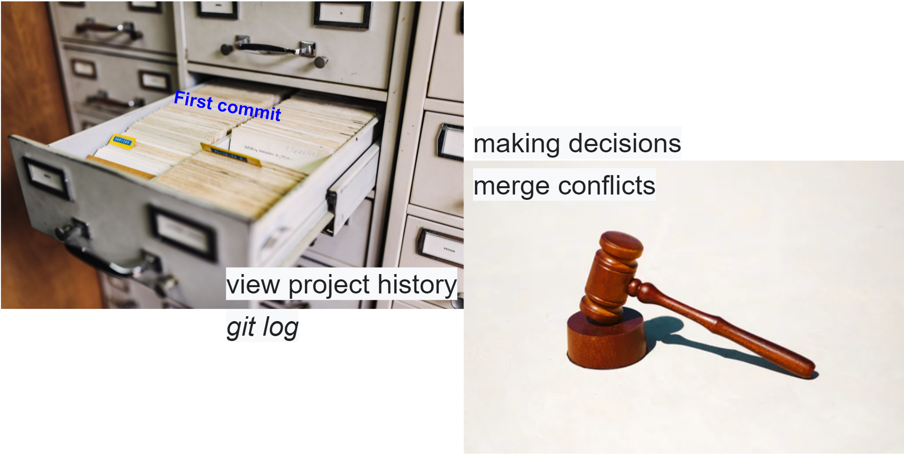

```{r setup, include=FALSE}
options(htmltools.dir.version = FALSE)
```

```{r xaringan-themer, include=FALSE, warning=FALSE}
library(xaringanthemer)
library(xaringanExtra)
library(tidyverse)
library(knitr)
library(nomnoml)
library(countdown)
xaringanExtra::use_logo(
  image_url = "https://raw.githubusercontent.com/rstudio/hex-stickers/master/PNG/xaringan.png"
)
xaringanExtra::use_panelset()
xaringanExtra::use_broadcast()
xaringanExtra::use_share_again()
xaringanExtra::style_share_again(share_buttons = c("twitter", "linkedin"))
xaringanExtra::use_tachyons()
xaringanExtra::use_fit_screen()
xaringanExtra::use_tile_view() # O
style_mono_accent(
  base_color = "#0dc96f",
  background_color = "#ffffff",
  inverse_background_color = "#3298cb",
  header_color = "#022044",
  inverse_header_color = "#ffffff", 
  inverse_text_color = "#ffffff",
  code_inline_color = "#179c55",
  link_color= "#0000FF",
  text_font_size = "25px",
  header_font_google = google_font("Poppins", "Regular", "400"),
  text_font_google   = google_font("Darker Grotesque", "500"),
  code_font_google   = google_font("Fira Mono"),
  )

```

```{r metathis, warning=FALSE, echo=FALSE}
# library(metathis)
# meta() %>%
#   meta_name("github-repo" = "flor14/rladies-jujuy") %>% 
#   meta_social(
#     title = "Meetup R-Ladies Jujuy",
#     description = paste(
#       "Mi próximo artículo científico con R:", 
#       "Compendios de Investigación, Reproducibilidad e",
#       "Interactividad en las publicaciones académicas"
#     ),
#     url = "https://flor14.github.io/rladies-jujuy/presentacion.html?panelset=licencia#1",
#     image = "https://res.cloudinary.com/flor/image/upload/v1608248822/jujuy-colores_frmvax.jpg",
#     image_alt = paste(
#       "Charla para el capítulo de R-Ladies de Jujuy, Argentina.",
#       "Diciembre de 2020"
#       ),
#     og_type = "website",
#     og_author = "Florencia D'Andrea",
#     twitter_card_type = "summary_large_image",
#     twitter_creator = "@cantoflor_87",
#     twitter_site = "@cantoflor_87"
#   )
```


class: middle, center

```{r hex, fig.align='center', echo = FALSE, out.width=150} 
    knitr::include_graphics("img/hex.png")
```


---


class: bottom

.bg-washed-blue.b--dark-blue.ba.bw2.br3.shadow-5.ph4.mt5[
### DSCI 521 - Lecture 3
### **Branches, forks, and streams... Welcome to the Git nature walk!**

 .large[#### Computing Platforms for Data Science - UBC MDS 2021/22
]]


---

## Lecture 3

1 **Develop a feature on a branch** in a Git repo.

--

2. **Merge** the feature branch with the master branch.

--

3. Create a **fork** of an existing GitHub repo.

--

4. Open a **pull request** from your forked repo to the upstream repo


---


class: center, middle

```{r obj2, fig.align='center', echo = FALSE,out.width=900} 

```


.footnote[[images: Unsplash](https://unsplash.com)]
---


class: center, middle, inverse

# BRANCHES
separate work 

---

## Why to use them?

* You don't want the repository's default branch to be updated with every commit of a half-finished feature.

* When features are completed, their branches will be merged into the main branch, often through a "pull request" where code is reviewed before it is merged. 


---


```{r obj4, fig.align='center', echo = FALSE,out.width=500} 
knitr::include_graphics("img/branches-house-analogy.png")
```


```{r house2, fig.align='center', echo = FALSE,out.width=500} 
knitr::include_graphics("img/house.jfif")
```

.footnote[[house image: Unsplash](https://unsplash.com)]

---

###

`HEAD -> main`

**main** is your default local branch

**HEAD** is where you currently (on the main branch)  


> You are on the main branch


---

###

`origin/main`

**origin** is a nickname for your remote repo on GitHub

**origin/main** is the main branch on your GitHub repo


> You Github repo is on the main branch

.footnote[_Note: In older repos `main` branch was called `master` branch_]

---

`origin/HEAD`

You don't need to care about origin/HEAD, it just point to the default remote branch, 
which will always be main unless you mess around with the settings on the GitHub webpage.

.footnote[_Note: In older repos `main` branch was called `master` branch_]

---


## Now all together

Now let's see what happens when we make a commit locally


---

class: center, inverse, middle

# How do we create a branch?


---


## Switch to a branch
#### `git switch`


##  Switch to a new branch
#### `git switch -c <name new branch>`
#### `git switch -c lecture-todo`


.footnote["It is good practice to give branches a name that succinctly describes the feature that you want to develop."]
---

## Pushing to a new branch

```{r branch, fig.align='center', echo = FALSE,out.width=700} 
knitr::include_graphics("img/gitpush_newbranch.png")
```

---


---


